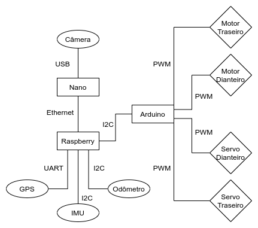
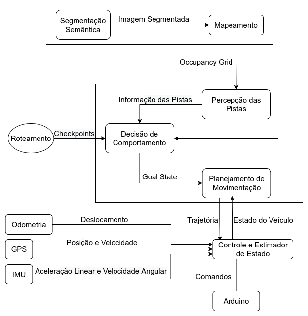

# Módulos, ferramentas e experimentos do Crawler

## O que é o Crawler?
O Crawler é um veículo autônomo em desenvolvimento. Abaixo há duas fotografias do Crawler.

## Funcionamento Geral do Crawler

Os dispositivos presentes no Crawler estão representados na imagem abaixo.

A arquitetura de software do Crawler está representada na imagem abaixo.

A câmera captura uma imagem e passa essa imagem para o componente que realiza a segmentação semântica, o qual por sua vez manda a imagem segmentada para o componente de mapeamento que por sua vez gera o occupancy grid. Em seguida, o OG é enviado para o componente de percepção das pistas, o qual envia as informações geradas para o componente de decisão de comportamento que por sua vez gera um goal state e o manda para o componente de planejamento de movimentação. O planejamento de movimentação usa o occupancy grid e o goal state para gerar uma trajetória, a qual é enviada para o componente de controle que junto com as informações processadas da odometria, do GPS e da IMU envia comandos para os motores e os servos via Arduino. Os dois retângulos maiores simbolizam que os componentes dentro fazem parte do mesmo programa. O estimador de estado do controle fornece ao componente de decisão de comportamento e ao componente de planejamento de movimentação uma estimativa do estado do veículo. Por fim, os checkpoints são fornecidos pelo componente de roteamento que está representado de forma diferente pois durante a navegação não existe realmente um componente de roteamento executando, há apenas os checkpoints gerados por esse componente. A segmentação semântica e o mapeamento estão na Nano. No Arduino, está apenas a interface com os atuadores. Todos os outros componentes estão na Raspberry.

## Arquivos

Neste repositório estão presentes os componentes da segmentação semântica e mapeamento em [**`nano_ws`**](./nano_ws/). 

Já a percepção de pistas, 
decisão de comportamento (definição do goal state) e planejamento de movimentação estão em [**`rasp_skel_gs_plan`**](./rasp_skel_gs_plan/). 

Há diversos experimentos que realizamos também. 
Em [**`skeletonize_and_goal_state_tests`**](./skeletonize_and_goal_state_tests/) estão os experimentos 
relacionados com a esqueletonização e definição do goal state.
Em [**`occupancy_grid_tests_p`**](./occupancy_grid_tests_p/) estão os experimentos relacionados com a geração do occupancy grid. 
Em [**`ompl_tests`**](./ompl_tests/) estão os experimentos relacionados com o planejamento de movimentação.

Na pasta [**`exps`**](./exps/), salvamos os nossos experimentos. Deixamos aqui um experimento de exemplo.

Em [**`camera_calibration`**](./camera_calibration/) há o código necessário para encontrar os parâmetros intrínsecos de uma câmera. 

## Alguns Detalhes

### Comunicação entre os processos da Raspberry e da Nano

Usamos socket com TCP - a Nano e a Raspberry estão conectadas por um cabo Ethernet. Deixamos o processo da Raspberry como servidor e o da Nano como cliente. Na Nano há uma configuração inicial do cliente socket e assim que o occupancy grid (OG) é gerado, o processo da Nano espera o processo da Raspberry avisar que está pronto para receber o OG; com a confirmação recebida, o OG é enviado. Na Raspberry, foi adicionada a configuração inicial do servidor socket. Além disso, criamos mais 3 threads para o processo: uma para receber o OG (receiver), outra para fazer tudo desde o pré-processamento com morfologia matemática até gerar a trajetória (processor) e outra para copiar o OG da receiver para a processor (copier).

### Mais informações
O arquivo [**`TCC_Nicolas_Goeldner.pdf`**](../docs/TCC_Nicolas_Goeldner.pdf) apresenta muito mais informações do que as apresentadas aqui neste repositório. Alguns exemplos do que há a mais no pdf são: várias explicações do funcionamento de diversos componentes do Crawler; explicações de várias decisões tomadas durante o desenvolvimento; experimentos realizados durante o desenvolvimento; conceitos básicos relacionados com navegação autônoma e planejamento de movimentação. Caso surja qualquer dúvida, consulte o pdf.