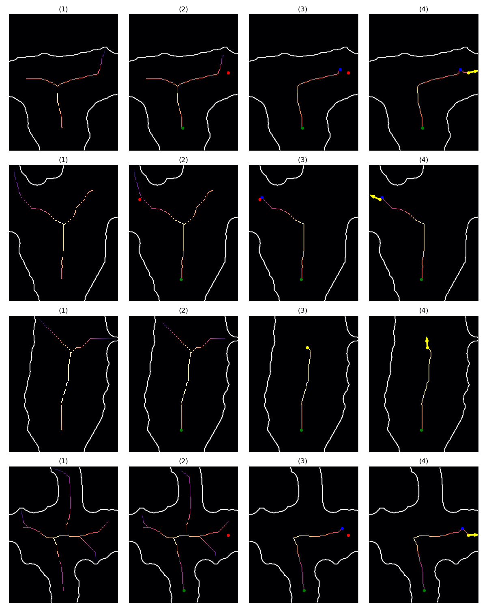
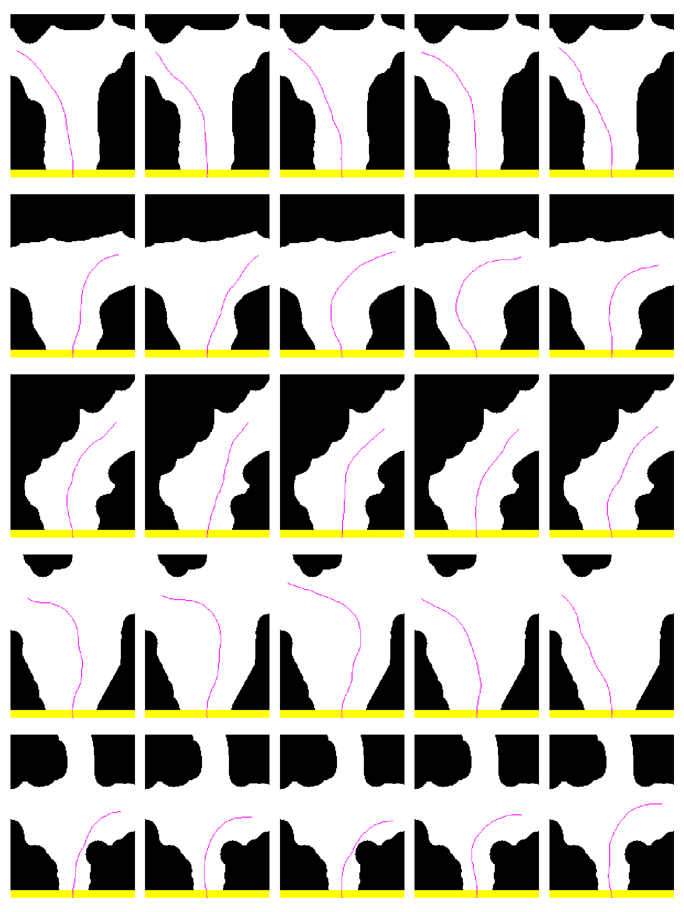

# Percepção das Pistas de Trânsito, Definição do Goal State e Planejamento de Movimentação

Nesse diretório está o código que foi utilizado pela Raspberry para receber o occupancy grid, fazer a esqueletonização, 
definir um goal state e planejar a movimentação.

## Funcionamento da Percepção das Pistas de Trânsito e Definição do Goal State

A única fonte de informação que o Crawler tem do ambiente é a câmera monocular. Ele tira uma foto do ambiente, faz a segmentação semântica e gera o occupancy grid. Uma observação é que o occupancy grid possui várias falhas da segmentação semântica que atrapalham as próximas etapas. Por isso, fazemos um pré-processamento com operações de abertura e fechamento da morfologia matemática. Em seguida, usamos esqueletonização para obter as uma representação simplificada da via.

Criamos um método que depende da proximidade ao próximo checkpoint para guiar o Crawler corretamente pela sua rota. Se o Crawler está longe de um checkpoint, ele, simplesmente, escolhe como goal state o ponto (pertencente ao esqueleto, com uma certa distância das bordas, alcançável e não tão próximo da borda quanto outros pontos) que está mais longe dele.  Agora, se o Crawler está perto de um checkpoint, ele seleciona um ponto (pertencente ao esqueleto, com uma certa distância das bordas e alcançável) que está mais perto do checkpoint e, em seguida, traça um caminho desse ponto ao checkpoint (estendendo o esqueleto) e seleciona como goal state o ponto mais próximo do checkpoint -  esse ponto deve estar a uma certa distância da borda e deve ser um ponto antes de, eventualmente, cruzar a borda. A orientação é definida por alguns pixels do caminho do pixel mais próximo do Crawler até o goal state.

A seguir apresentamos uma imagem de exemplos do passo a passo do método de definição do goal state desenvolvido.

Na imagem, separamos em quatro etapas a obtenção do goal state. Em (1), mostramos o occupancy grid pré-processado com o esqueleto. Em (2), mostramos o ponto mais próximo do Crawler em verde e o checkpoint, se existir, em vermelho. Em (3), apresentamos o caminho selecionado e o ponto pertencente ao esqueleto que nos fez escolhê-lo. Quando não temos checkpoint o ponto estará em amarelo (representando a posição do goal state) e quando temos checkpoint o ponto estará em azul. Em (4), quando temos checkpoint estendemos o caminho a partir do ponto azul e, assim, obtemos o ponto amarelo representando o goal state; se o ponto vermelho não estiver visível em (3) ou em (4) é porque o ponto azul ou o amarelo podem estar por cima. Além disso, em (4), mostramos a orientação do goal state. A terceira linha representa um caso em que não há checkpoint próximo; para as demais há.

## Funcionamento do Planejamento de Movimentação

Para o planejamento de movimentação utilizamos um planner chamado de SST (Stable Sparse RRT). Utilizamos a implementação da biblioteca OMPL (Open Motion Planning Library). O planejamento de movimentação utiliza o occupancy grid para saber quais estados são válidos e utiliza o goal state como objetivo final para o planejamento. Abaixo apresentamos uma imagem com exemplos de trajetórias geradas.

## Arquivos
Os principais arquivos desta pasta são o [**`skel_gs_plan.cpp`**](./skel_gs_plan.cpp) e o [**`skel_gs_plan.h`**](./skel_gs_plan.h). 
Nesses dois arquivos está o código necessário para receber o occupancy grid até gerar uma trajetória.

Na pasta [**`skel_gs_results`**](./skel_gs_results) são salvos alguns resultados intermediários da esqueletonização e da definição do goal state.
Já na pasta [**`solution_paths`**](./solution_paths) são salvas as trajetórias geradas pelo planejamento de movimentação.

Para visualizar os resultados presentes em `skel_gs_results` e `solution_paths` os arquivos 
[**`read_skel_gs_results_and_plot.py`**](./read_skel_gs_results_and_plot.py) e 
[**`read_plan_results_and_plot.py`**](./read_plan_results_and_plot.py) podem ser executados. 
As imagens geradas serão salvas nas pastas 
[**`visualize_skel_gs_results`**](./visualize_skel_gs_results) e [**`visualize_plan_results`**](./visualize_plan_results).

Deixamos nas pastas `skel_gs_results`, `solution_paths`, `visualize_skel_gs_results` e `visualize_plan_results` alguns exemplos de resultados.

Para realizar algum teste sem a Nano presente, podemos simular seu comportamento usando o arquivo 
[**`client_send_ogs_checkpoints.cpp`**](./client_send_ogs_checkpoints.cpp). Esse arquivo envia occupancy grids da mesma forma que a Nano os envia, 
a diferença é que esse arquivo lê occupancy grids já gerados (não os gera). O tempo de espera entre envios de occupancy grids pode ser mudado no código. 
Esse tempo simula o tempo que a Nano levaria para fazer a segmentação semântica, gerar a máscara e o occupancy grid, dentre outros pequenos detalhes.
Além disso, neste arquivo é possível adicionar checkpoints em posições do occupancy grid para testar o comportamento de todo o processo quando o Crawler
estiver próximo de um checkpoint.

Os occupancy grids utilizados e seus checkpoints (se desejar adicioná-los) estão definidos em 
[**`checkpoint_file_list/list.txt`**](./checkpoint_file_list/list.txt). A maneira de definir occupancy grids e checkpoints é bem intuitiva.

> Os occupancy grids devem estar armazenados na pasta 
> [**`../occupancy_grid_tests_p/correct_nano_ogs/new_ogs/`**](../occupancy_grid_tests_p/correct_nano_ogs/new_ogs)

Por fim, os arquivos [**`exp_read_skel_gs_results_and_plot.py`**](./exp_read_skel_gs_results_and_plot.py) e 
[**`exp_read_plan_results_and_plot.py`**](./exp_read_plan_results_and_plot.py) podem ser usados para visualizar os resultados equivalentes aos 
armazenados nas pastas `skel_gs_results` e `solution_paths` se os resultados estiverem armazenados em 
`../exps/<exp_number>/skel_gs_results` e `../exps/<exp_number>/solution_paths`. As imagens serão salvas em
`../exps/<exp_number>/visualize_skel_gs_results` e `../exps/<exp_number>/visualize_solution_paths`. Para escolher o exp_number 
basta passar o número como entrada para os .py.
